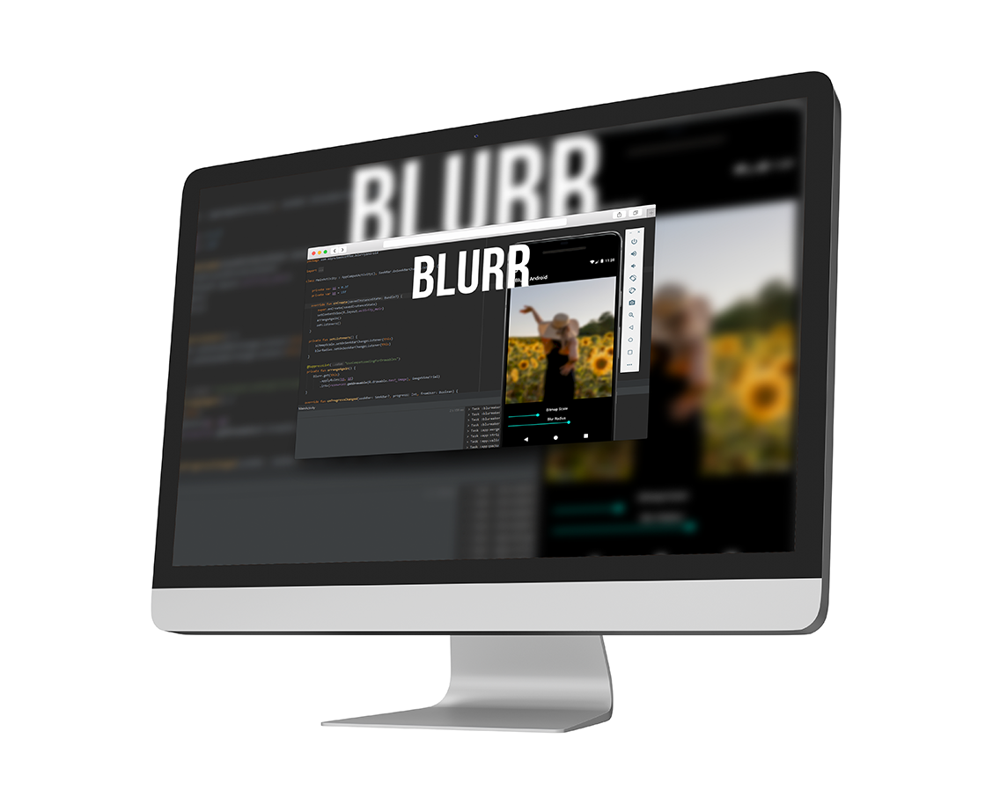

# Blurr :foggy: Easy Blur and Tools Library
> Simple and quick solution for blurred bitmaps.

[](https://kotlinlang.org/)
[](https://opensource.org/licenses/Apache-2.0)  


Async or Sync, you can quickly blur your images. The library supports Bitmap, Drawable and CustomViews. You have the opportunity to use the necessary libraries separately. If you encounter an error or problem, please open a issue. It will be fixed as soon as possible. :zap:



## Features

- [x] Kotlin
- [x] Rx3
- [x] CustomView to Bitmap (usefull for markers - osm and gmap)
- [x] Blurred Bitmaps
- [x] Drawable to Bitmap
- [x] Application Variants

## General Usage

```kotlin
/**
* @param bitmapScale should be 0-1f -> small values for more blur
* @param blurRadius should be 0-25f -> bigger values for more blur
*
* @exception RSIllegalArgumentException Radius out of range (0 < r <= 25)
* @exception NullPointerException void android.graphics.Bitmap.setHasAlpha(boolean)
**/   

 fun applyRules(bitmapScale: Float, blurRadius: Float): Blurr {
   bS = bitmapScale
   bR = blurRadius
   return this
}
```

#### Convert Drawable to Blurred Bitmap (async)

```kotlin
Blurr.get(this)
     .applyRules(bS, bR)
     .into(resources.getDrawable(R.drawable.test_image), imageViewTrial) //async
```

#### Convert Drawable to Blurred Bitmap (sync)

```kotlin
val bitmap2 = Blurr
        .get(this)
        .applyRules(bS, bR)
        .solution(resources.getDrawable(R.drawable.test_image))
```


#### Convert View Blurred Bitmap (async)

```kotlin
Blurr.get(this)
     .applyRules(bS, bR)
     .into(view, imageViewTrial) //async
```


#### Convert View Blurred Bitmap (sync)
```kotlin
val bitmap1 = Blurr
        .get(this)
        .applyRules(bS, bR)
        .solution(view)
```


#### Convert Bitmap to Blurred Bitmap (async)

```kotlin
Blurr.get(this)
     .applyRules(bS, bR)
     .into(bitmap!!, imageViewTrial) //async
```


#### Convert Bitmap to Blurred Bitmap (sync)

```kotlin
val bitmap3 = Blurr
       .get(this)
       .applyRules(bS, bR)
       .solution(bitmap!!)
```


#### Tools: Bitmap From Custom Views

```kotlin
 val bitmap4 = Blurr
        .getTools()
        .bitmapFromCustomView(view)
```


#### Tools: Bitmap From Drawable

```kotlin
val bitmap5 = Blurr
        .getTools()
        .bitmapFromDrawable(resources.getDrawable(R.drawable.test_image))
```


### Implementation Gradle

###### Add it in your root build.gradle at the end of repositories

```groovy
allprojects {
    repositories {
        maven { url 'https://jitpack.io' }
    }
}
```

###### Add the dependency

```groovy
dependencies {
    implementation 'com.github.AsynctaskCoffee:BlurryAndroid:beta-0.1'
}
```

### Implementation Maven

###### Add the JitPack repository to your build file

```xml
<repositories>
	<repository>
		<id>jitpack.io</id>
		<url>https://jitpack.io</url>
	</repository>
</repositories>
```

###### Add the dependency

```xml
<dependency>
	<groupId>com.github.AsynctaskCoffee</groupId>
	<artifactId>BlurryAndroid</artifactId>
	<version>beta-0.1</version>
</dependency>
```


## License

```
Copyright 2020 Egemen ÖZOGUL

Licensed under the Apache License, Version 2.0 (the "License");
you may not use this file except in compliance with the License.
You may obtain a copy of the License at

    http://www.apache.org/licenses/LICENSE-2.0

Unless required by applicable law or agreed to in writing, software
distributed under the License is distributed on an "AS IS" BASIS,
WITHOUT WARRANTIES OR CONDITIONS OF ANY KIND, either express or implied.
See the License for the specific language governing permissions and
limitations under the License.
```

